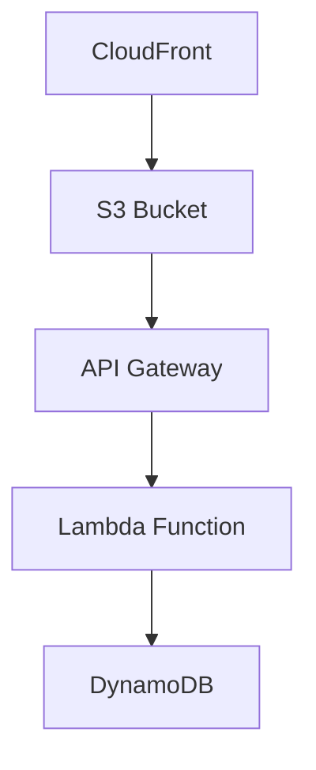

# 🌟 Cloud Resume Challenge - A Serverless Journey

Welcome to my Cloud Resume Challenge implementation! This project showcases a serverless resume website with a visitor counter, built using modern cloud technologies.

## 🎯 Project Overview

This project is my implementation of the [Cloud Resume Challenge](https://cloudresumechallenge.dev/), demonstrating practical cloud engineering skills through a real-world application.

## 🏗️ Architecture



## 🛠️ Technologies Used

| Category | Technologies |
|----------|-------------|
| Frontend | HTML5, CSS3, JavaScript |
| Backend | AWS Lambda (Python 3.11) |
| Database | Amazon DynamoDB |
| Infrastructure | AWS CDK (TypeScript) |
| CI/CD | GitHub Actions |
| AWS Services | S3, CloudFront, ACM, API Gateway |

## 🚀 Getting Started

### Prerequisites
```bash
npm install -g aws-cdk
python3 -m pip install aws-cdk.core
```

### Clone and Install
```bash
git clone https://github.com/yourusername/cloud-resume-challenge.git
cd cloud-resume-cdk
npm install
```

### Deploy
```bash
npm run build
cdk deploy
```

## 📁 Project Structure
```
cloud-resume-challenge/
├── cloud-resume-cdk/
│   ├── website/
│   │   ├── images/      # Local images (not tracked in Git)
│   │   ├── styles.css
│   │   └── index.html
│   └── ...
└── ...
```

### 🖼️ Image Handling
- Images are stored locally in `website/images/`
- Not tracked in Git to keep repository size small
- Deployed to S3 bucket during CDK deployment

## 🔧 Development Commands

| Command | Description |
|---------|-------------|
| `npm run build` | Compile TypeScript code |
| `npm run test` | Run unit tests |
| `cdk deploy` | Deploy to AWS |
| `cdk diff` | Show infrastructure changes |
| `cdk synth` | Generate CloudFormation template |

## 🎨 Features

- ✨ Responsive design
- 📊 Visitor counter using DynamoDB
- 🔒 HTTPS security with ACM
- 🚀 Global content delivery via CloudFront
- 🤖 Automated deployments with GitHub Actions
- 🏗️ Infrastructure as Code using AWS CDK
- 🔄 CI/CD pipeline integration

## 🌐 Live Demo

Visit my resume at: [www.mitchdc.com](https://www.mitchdc.com)

## 📖 Documentation

For a detailed explanation of how this project was built, check out the [How It Was Built](https://www.mitchdc.com/how-it-was-build.html) page.

## 🤝 Contributing

1. Fork the repository
2. Create your feature branch: `git checkout -b feature/amazing-feature`
3. Commit your changes: `git commit -m 'Add amazing feature'`
4. Push to the branch: `git push origin feature/amazing-feature`
5. Open a Pull Request

## 📜 License

This project is MIT licensed. See the [LICENSE](LICENSE) file for details.

## 👨‍💻 Author

**Michelangelo Di Croce**
- LinkedIn: [Michelangelo Di Croce](https://www.linkedin.com/in/michelangelo-di-croce/)
- Website: [www.mitchdc.com](https://www.mitchdc.com)

---

*Built with ☕ and cloud computing passion*